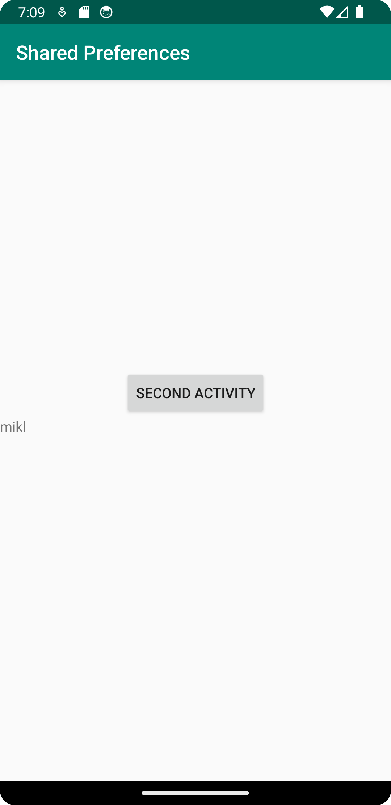
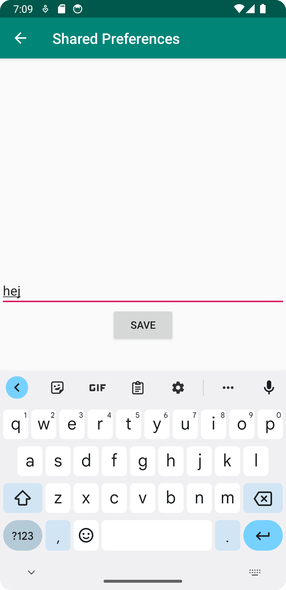
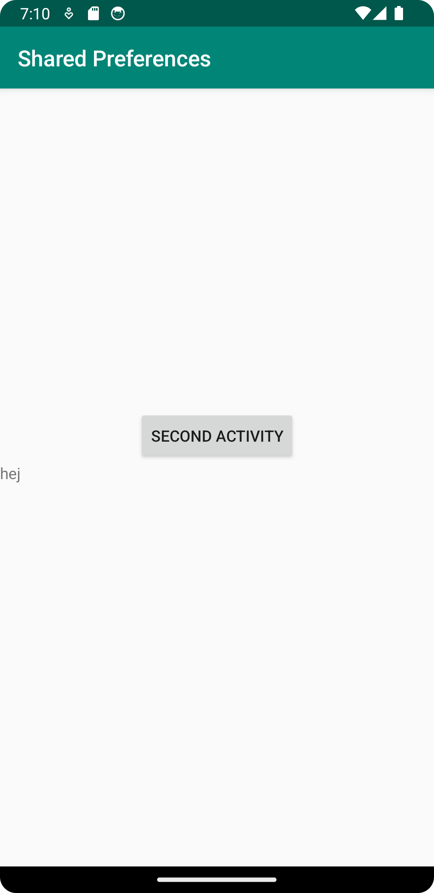

# Rapport
Projektet började med att implementera preferenses i MainActivity. Där lades det in funktionalitet för att spara och hämta information om en string som också lades till i strings.xml.
En knapp lades till i layouten som kallade på en metod som heter savePref som sparade texten i en edittext view till stringen i strings.xml. Eftersom kod finns i onCreate som hämtar den stringen och sätter den till värdet på en TextView, så kan man nu starta om appen och stringens data är sparat.  
Därefter lades det till en ny activity som hette SecondActivity. I den så flyttades nästan all layoutkod från MainActivity till SecondActivity, samt mycket av koden i MainActivity.java till SecondActivity.java, så att det gick att spara stringen i SecondActivity istället.  
Dock så kunde inte den stringen visas i MainActivity, utan preferences fick ändras till en shared preferences så att data kunde sparas globalt över appen.   
Till slut lades MainActivity till som parent till SecondActivity så att det går snabbt att gå fram och tillbaka i appen och se uppdateringen. En onResume-metod lades också till i MainActivity med nästan all kod som låg i onCreate. Appen verkade fungera som den borde utan onResume, men det stod i uppgiftsbeskrivningen att den kunde användas så den lades till för säkerhets skull.
# Kod
```
    public void savePref(View v){
        EditText newPrefText = findViewById(R.id.settingseditview);

        // Store the new preference
        myPreferenceEditor.putString("MyAppPreferenceString", newPrefText.getText().toString());
        myPreferenceEditor.apply();

        // Display the new preference
        TextView prefTextRef = findViewById(R.id.prefText);
        prefTextRef.setText(myPreferenceRef.getString("MyAppPreferenceString", "No preference found."));

        // Clear the EditText
        newPrefText.setText("");
    }
```
Kod som beskriver vad som händer när en knapp trycks in som har en onClick till den metoden. När metoden kallas tas en text från en EditText view och "storas" i myPreferenceEditor som är namnet på editorn av appens SharedPreferences. Därefter kallas apply på den så att datan blir commitad till SharedPreferences. Bara för att se så att något faktiskt skett så hittar sedan metoden en TextView och sätter dess text till EditText-värdet.
# Bilder



